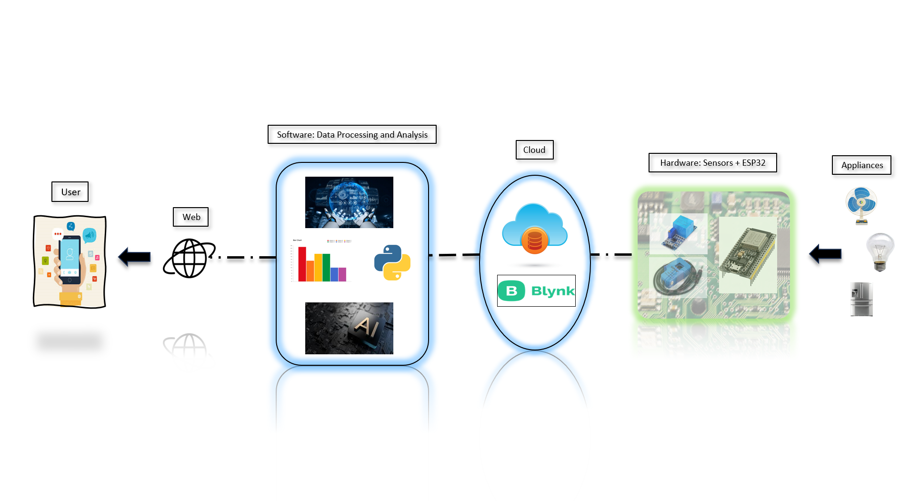
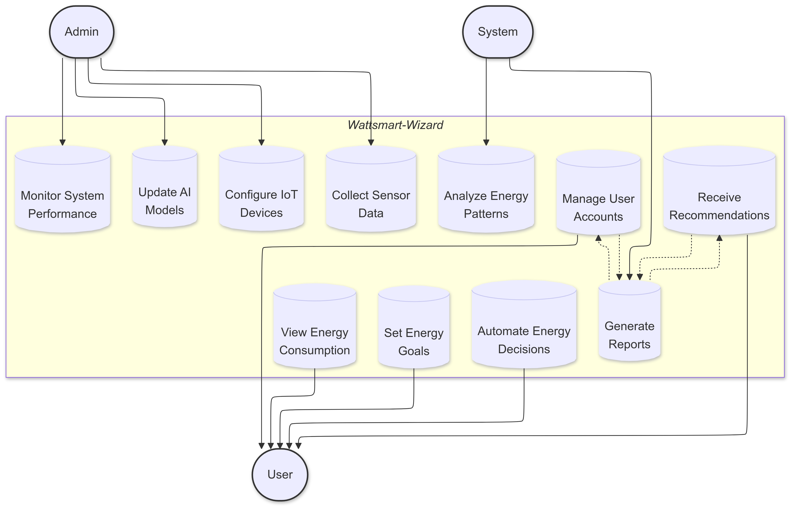
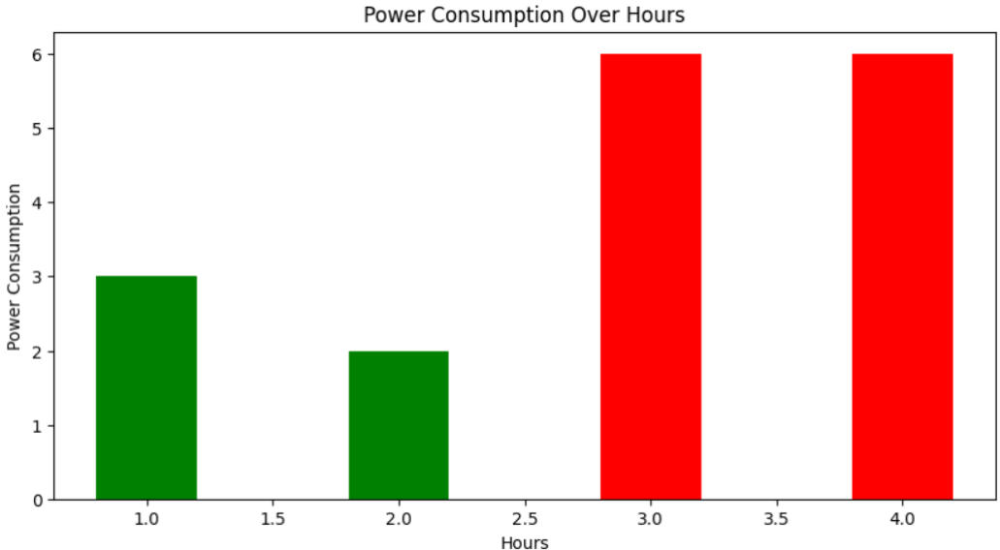
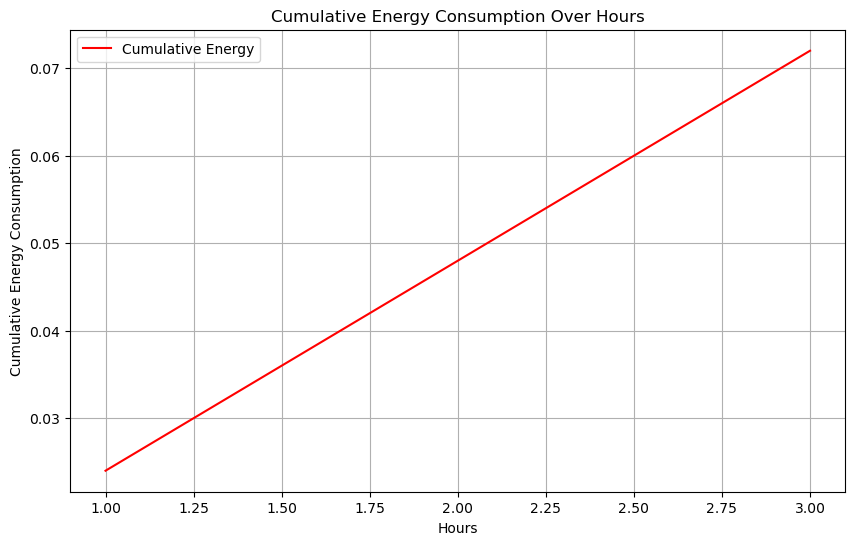

<h1 align="center">⚡ <b>WattSmart Wizard</b> ⚡</h1>
<p align="center">
    <i>An IoT + AI Driven Energy Monitoring and Optimization Solution</i><br>
    <b>by</b> <b>The-X-Factors</b> 🤖
</p>
<p align="center">
    <i>WattSmart addresses the critical global issue of resource wastage and inefficiency in energy and water management. Through a combination of IoT sensors, real-time data processing via cloud computing, and AI-powered analytics, the system monitors energy consumption and automates resource optimization. It offers personalized recommendations, alerts, and insights, allowing users to minimize waste and lower costs. The seamless integration of hardware and software makes the solution scalable, impacting both household and industrial sectors. Its focus on sustainability promotes environmental conservation while providing significant economic and social benefits.</i>
</p>


<h1 align="center">📚 Overview 📚</h1>
<p align="center">
    <i>This project aims to tackle the problems of Energy mismanagement, Increasing Carbon Footprint and Surging Utility Costs. It falls within the intersection of IoT (Internet of Things), Machine Learning, and Energy Management Systems. It uses IoT sensors to collect real-time energy consumption data, which is then processed and analyzed using ML algorithms like Linear Regression for consumption prediction and DBSCAN for anomaly detection. The backend, built with Flask, handles data retrieval, management, and storage, enabling a seamless user experience. The system's primary goal is to optimize energy usage, reduce costs, and support sustainability efforts by providing actionable insights and predictive analytics for better decision-making in real-world applications.</i>
</p>

<h1 align="center">💡 Idea 💡</h1>
<p align="center">
    WattSmart Wizard is designed to tackle inefficiencies in energy, power, costs by utilizing cutting-edge technologies like IoT, Cloud Computing, and Machine Learning. Below are the core features:
</p>

- **Real-Time Energy Data Collection**  
  Energy consumption data is captured using IoT sensors connected to an ESP32 device, enabling wireless transmission of real-time readings for seamless monitoring.
- **Cloud-Based Data Storage & Management**  
  Data is securely stored on the cloud, allowing for scalable storage and remote access, enabling long-term analysis and retrieval.
- **Seamless Data Retrieval for Processing**  
  Data is fetched via a RESTful API to enable smooth integration between cloud storage and backend systems for real-time processing and insights.
- **Data Analysis & Insight Generation**  
  Data is processed using Python and data science libraries like NumPy, Pandas, and Matplotlib to uncover usage patterns, trends, and anomalies.
- **Forecasting & Anomaly Detection**  
  Machine learning models (Linear Regression for power consumption prediction and DBSCAN for anomaly detection) identify future energy usage, predict costs, and flag unexpected consumption spikes.
- **Interactive Dashboard for Real-Time Monitoring**  
  A Flask-based web application displays dynamic insights, predictions, and alerts, providing users with actionable data on their energy consumption and cost-saving opportunities.
- **Impact on Energy Efficiency & Cost Reduction**  
  The system helps users optimize energy usage, detect inefficiencies, and reduce costs, contributing to sustainability and more efficient energy consumption.

### System Architecture



### Use Case Diagram



### Insights

<p align="center">
  
  
  
</p>

### Prototype

<p align="center">
 
 
</p>

#### Prototype Video
[▶️ Watch the Working Prototype Video](https://drive.google.com/open?id=1VCtfgA5qeQg3G2F6PMCztmdKp7CI7jVL&usp=drive_copy)

---

### Impact 

<div align="center">

| Impact Area | Potential Benefits |
|------------|-------------------|
| 💰 **Energy Cost Reduction** | Optimizing usage can lower monthly energy bills by **15-30%** |
| 🔧 **Early Equipment Maintenance** | Anomaly detection helps identify faulty equipment, potentially reducing **maintenance costs by 20-40%** |
| 🌍 **Carbon Footprint Reduction** | Energy optimization can cut **1-2 tons of CO2 emissions per year** for an average household |
| 💼 **Business Savings** | Scalable for enterprises, potentially saving **millions annually** on energy costs |
| ⚡ **Peak Demand Reduction** | Real-time monitoring allows for better decision-making, reducing **peak demand by 10-20%** |
| 🌱 **Supporting Renewable Energy** | Easier integration of **renewables**, improving grid efficiency |
| 🔋 **Grid Efficiency** | Widespread use could reduce strain on national grids, saving **billions** globally |

</div>

---

<h1 align="center">🏆 Achievements🏆</h1>
<p align="center">
</p>

- **🏆 Top 5 Winners (4th Place)** – BuzzOnEarth Hackathon, National AI and Sustainability Hackathon by Intel and IIT Kanpur.

- **🥇 Winners** – State Innovation Challenge by World Wildlife Federation (WWF).

- **🚀 Winners** – Entrepreneurship-Week 2024, National Idea and Startup Competition at Jaipuria Institute of Management, Jaipur.


<h1 align="center">🚀 How to Execute Our Code Sample 🚀</h1>
<p align="center">
    Follow these steps to run the WattSmart Wizard code on your local machine. Make sure you have Python and `pip` installed before proceeding.
</p>

### **Step 1: Clone the Repository**
First, clone the repository to your local machine using the following command:
```bash
    git clone https://github.com/aumleo/The-X-Factors.git
```

### **Step 2: Navigate to the Project Directory**
```markdown
    cd The-X-Factors
```

### **Step 3: Set Up a Virtual Environment (Optional but Recommended)**
```bash
    python -m venv venv
    .\venv\Scripts\activate
```

### **Step 4: Install Dependencies**
```markdown
    pip install -r requirements.txt
```
---
